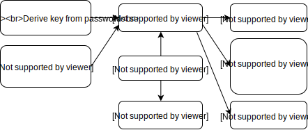

# Aegis Vault

Aegis persists the user's token secrets and related information to a file. This
file is referred to as the __vault__. Users can configure the app to store the
vault in plain text or to encrypt it with a password.

This document describes Aegis' security design and file format. It's split up
into two parts. First, the cryptographic primitives and use of them for
encryption are discussed. The second section documents the details of the file
format of the vault.

## Security

### Primitives

Two cryptographic primitives were selected for use in Aegis. An Authenticated
Encryption with Associated Data
([AEAD](https://en.wikipedia.org/wiki/Authenticated_encryption#Authenticated_encryption_with_associated_data))
cipher and a Key Derivation Function
([KDF](https://en.wikipedia.org/wiki/Key_derivation_function)).

#### AEAD

__AES-256__ in __GCM__ mode is used as the AEAD cipher to ensure the
confidentiality, integrity and authenticity of the vault contents.

This cipher requires a unique 96-bit nonce for each invocation with the same
key. This is not ideal, because 96 bits is not large enough to comfortably
generate an unlimited amount of random numbers without getting collisions at
some point. It is not possible to use a monotonically increasing counter in this
case, because a future use case could involve using the vault on multiple
devices simultaneously, which would almost certainly result in nonce reuse. As a
repeat of the nonce would have catastrophic consequences for the confidentiality
of the ciphertext, NIST strongly recommends not exceeding 2<sup>32</sup>
invocations when using random nonces with GCM. As such, the security of the
Aegis vault also relies on the assumption that this limit is never exceeded.
This is a reasonable assumption to make, because it's highly unlikely that an
Aegis user will ever come close to saving the vault 2<sup>32</sup> times.

_Switching to a nonce misuse-resistant cipher like AES-GCM-SIV or a cipher with
a larger (192 bits) nonce like XChaCha-Poly1305 will be considered in the
future._

#### KDF

[__scrypt__](https://en.wikipedia.org/wiki/Scrypt) is used as the KDF to derive
a key from a user-provided password, with the following parameters:

| Parameter | Value          |
|:----------|:---------------|
| N         | 2<sup>15</sup> |
| r         | 8              |
| p         | 1              |

These are the same parameters as Android itself uses to derive a key for
full-disk encryption. Because of the memory limitations Android apps have, it's
not possible to increase these parameters without running into OOM conditions on
most devices.

_Argon2 is a more modern KDF that's a bit more flexible than scrypt, because it
allows tweaking the memory-hardness parameter and CPU-hardness parameter
separately, whereas scrypt ties those together into one cost parameter (N). It
will be considered as an alternative option to switch to in the future._

### Encryption

When a vault is first created, a random 256-bit key is generated that is used to
encrypt the contents with AES in GCM mode. This key is referred to as the
__master key__.

Aegis supports unlocking a vault with multiple different credentials. The main
credential is a key derived from a user-provided password. In addition to that,
users can also add a key backed by the Android KeyStore as a credential, which
is only usable after biometrics authentication.

#### Slots

Each credential that should be able to encrypt/decrypt the contents of a vault
has its own __slot__. Every slot contains a copy of the master key that is
encrypted with its credential. The process of encrypting a key with another key
is known as __key wrapping__. This allows obtaining the master key by providing
any of the credentials. An important consequence is that the master key is only
as secure as the weakest credential.

This design is similar to and largely inspired by LUKS' key slot system.

#### Integrity

Because of the use of an AEAD for encryption, the vault contents and encrypted
master keys in the slots are checked for integrity and authenticity. The rest of
the file is not.

### Overview



## Format

The vault is stored in JSON and encoded in UTF-8. The upper-level structure is
shown below:

```json
{
    "version": 1,
    "header": {},
    "db": {}
}
```

It starts with a ``version`` number. If a forwards incompatible change is
introduced to the vault format, the version number will be incremented. The
current version of the vault format is ``1``.

The [``header``](#header), if not empty, contains the list of slots and the
encryption parameters used for decrypting the vault.

The vault contents are stored under ``db``. Its value depends on whether the
vault is encrypted or not. If it is, the value is a string containing the Base64
encoded (with padding) ciphertext of the vault contents. Otherwise, the value is
a JSON object. See [vault content](#vault-content) for details.

Full examples of a [plain text
vault](/app/src/test/resources/com/beemdevelopment/aegis/importers/aegis_plain.json)
and an [encrypted
vault](/app/src/test/resources/com/beemdevelopment/aegis/importers/aegis_encrypted.json)
are available in the [test
data](/app/src/test/resources/com/beemdevelopment/aegis/importers) folder.
There's also an example Python script that can decrypt an Aegis vault given the
password: [decrypt.py](/docs/decrypt.py).

### Header

The header starts with the list of [``slots``](#slots-1). Each slot contains the
master key in an encrypted form together with the key wrapping parameters.

It also has a ``params`` object that holds the ``nonce`` and ``tag`` that were
produced during the AES-GCM encryption, encoded as a hexadecimal string. These
encryption parameters together with the master key (which can be retrieved by
decrypting the ``key`` from one of the slots) are used to decrypt the vault
contents found in the ``db`` field.

Setting ``slots`` and ``params`` to null indicates that the vault is not
encrypted and Aegis will try to parse it as such.

```json
{
    "slots": [],
    "params": {
        "nonce": "0123456789abcdef01234567",
        "tag": "0123456789abcdef0123456789abcdef"
    }
}
```

#### Slots

The different slot types are identified with a numerical ID.

| Type      | ID   |
|:----------|:-----|
| Raw       | 0x00 |
| Password  | 0x01 |
| Biometric | 0x02 |

##### Raw

This slot type is used for raw AES key credentials. It is not used directly in
the app, but all other slots are based on this slot type, so this section
applies to all of them.

Each slot transforms its credential in a way that it can be used to encrypt the
master key with AES-256 in GCM mode. The ``nonce``, ``tag`` and encrypted
``key`` are encoded as a hexadecimal string and stored together. Slots also have
a unique randomly generated ``UUID`` (version 4).

```json
{
    "type": 0,
    "uuid": "01234567-89ab-cdef-0123-456789abcdef",
    "key": "0123456789abcdef0123456789abcdef0123456789abcdef0123456789abcdef",
    "key_params": {
        "nonce": "0123456789abcdef01234567",
        "tag": "0123456789abcdef0123456789abcdef"
    }
}
```

##### Biometric

The structure of the Biometric slot is exactly the same as the Raw slot. The
difference is that the wrapper key is backed by the Android KeyStore, whereas
Raw slots don't imply use of a particular storage type.

##### Password

As noted earlier, scrypt is used to derive a 256-bit key from a user-provided
password. A random 256-bit ``salt`` is generated and passed to scrypt to protect
against rainbow table attacks. It's stored along with the ``N``, ``r`` and ``p``
parameters.

```json
{
    "type": 1,
    "uuid": "01234567-89ab-cdef-0123-456789abcdef",
    "key": "0123456789abcdef0123456789abcdef0123456789abcdef0123456789abcdef",
    "key_params": {
        "nonce": "0123456789abcdef01234567",
        "tag": "0123456789abcdef0123456789abcdef"
    },
    "n": 32768,
    "r": 8,
    "p": 1,
    "salt": "0123456789abcdef0123456789abcdef0123456789abcdef0123456789abcdef"
}
```

### Vault content

The content is a JSON object encoded in UTF-8.

```json
{
    "version": 3,
    "entries": [],
    "groups": []
}
```

It has a ``version`` number, a list of ``entries`` and a list of ``groups``. If
a forwards incompatible change is introduced to the content format, the version
number will be incremented. The current version of the vault content format is
``3``.

| Field       | Type  | Description                              |
|:------------|:------|:-----------------------------------------|
| ``version`` | int   | The version of the vault content format. |
| ``entries`` | array | A list of [entries](#entries).           |
| ``groups``  | array | A list of [groups](#groups).             |

#### Entries

Each entry has a unique randomly generated ``UUID``, as well as a ``name`` and
``issuer`` to identify the account name and service that the token is for.

Entries hold the following fields:

| Field         | Type           | Description                                                                     |
|:--------------|:---------------|:--------------------------------------------------------------------------------|
| ``type``      | string         | The type of the OTP algorithm. See table below.                                 |
| ``uuid``      | string         | A UUID (version 4).                                                             |
| ``name``      | string         | The account name.                                                               |
| ``issuer``    | string         | The service that the token is for.                                              |
| ``note``      | string         | A personal note about the entry.                                                |
| ``icon``      | string \| null | JPEG's encoded in Base64 with padding.                                          |
| ``icon_mime`` | string \| null | The MIME type of the icon. Is null if ``icon`` is null.                         |
| ``icon_hash`` | string \| null | The SHA-256 hash of the icon. Is null if ``icon`` is null.                      |
| ``favorite``  | bool           | Whether the entry is a favorite or not.                                         |
| ``info``      | object         | Information specific to the OTP type.                                           |
| ``groups``    | array          | A list of UUIDs of groups that the entry is a member of. See [Groups](#groups). |

The ``info`` object contains different fields depending on the type of the OTP.

There are a number of supported types:

| Type   | ID       | Spec                                                      |
|:-------|:---------|:----------------------------------------------------------|
| HOTP   | "hotp"   | [RFC 4226](https://datatracker.ietf.org/doc/html/rfc4226) |
| TOTP   | "totp"   | [RFC 6238](https://datatracker.ietf.org/doc/html/rfc6238) |
| Steam  | "steam"  | N/A                                                       |
| MOTP   | "motp"   | N/A                                                       |
| Yandex | "yandex" | N/A                                                       |

Common ``info`` fields for all types:

| Field      | Type   | Description                        |
|:-----------|:-------|:-----------------------------------|
| ``secret`` | string | The Base32 encoded secret.         |
| ``algo``   | string | The hashing algorithm.             |
| ``digits`` | int    | The number of digits in the token. |

Example of a TOTP entry:

```json
{
    "type": "totp",
    "uuid": "01234567-89ab-cdef-0123-456789abcdef",
    "name": "Bob",
    "issuer": "Google",
    "note": "Main account",
    "favorite": false,
    "icon": null,
    "icon_mime": null,
    "icon_hash": null,
    "info": {
        "secret": "ABCDEFGHIJKLMNOPQRSTUVWXYZ234567",
        "algo": "SHA1",
        "digits": 6,
        "period": 30
    },
    "groups": [
        "01234567-89ab-cdef-0123-456789abcdef"
    ]
}
```

##### HOTP and TOTP

TOTP uses the ``period`` field, which is the time step in seconds. HOTP uses the
``counter`` field, which is incremented every time a token is generated.

The following algorithms are supported for HOTP and TOTP:

| Algorithm | ID       |
|:----------|:---------|
| SHA-1     | "SHA1"   |
| SHA-256   | "SHA256" |
| SHA-512   | "SHA512" |

##### Steam

There is no specification available for Steam's OTP algorithm. It's essentially
the same as TOTP, but it uses a different final encoding step. Aegis'
implementation of it can be found in
[crypto/otp/OTP.java](/app/src/main/java/com/beemdevelopment/aegis/crypto/otp/OTP.java).

A couple of fields have fixed values:

| Field      | Value  |
|:-----------|:-------|
| ``algo``   | "SHA1" |
| ``period`` | 30     |
| ``digits`` | 5      |

##### MOTP

There is no specification available for MOTP. Aegis' implementation of it can be
found in
[crypto/otp/MOTP.java](/app/src/main/java/com/beemdevelopment/aegis/crypto/otp/MOTP.java).

A couple of fields have fixed values:

| Field      | Value |
|:-----------|:------|
| ``algo``   | "MD5" |
| ``period`` | 10    |
| ``digits`` | 6     |

MOTP-specific fields:

| Field   | Type   | Description |
|:--------|:-------|:------------|
| ``pin`` | string | 4-digit PIN |

##### Yandex

There is no specification available for Yandex's OTP algorithm. Aegis'
implementation can be found in
[crypto/otp/YAOTP.java](/app/src/main/java/com/beemdevelopment/aegis/crypto/otp/YAOTP.java)

A couple of fields have fixed values:

| Field      | Value    |
|:-----------|:---------|
| ``algo``   | "SHA256" |
| ``period`` | 30       |
| ``digits`` | 8        |

Yandex-specific fields:

| Field   | Type   | Description    |
|:--------|:-------|:---------------|
| ``pin`` | string | 4-16 digit PIN |

#### Groups

A group consists of a ``name`` and a randomly generated ``uuid`` (version 4).

| Field    | Type   | Description            |
|:---------|:-------|:-----------------------|
| ``uuid`` | string | A UUID (version 4).    |
| ``name`` | string | The name of the group. |

Example:

```json
{
    "uuid": "01234567-89ab-cdef-0123-456789abcdef",
    "name": "Personal"
}
```
